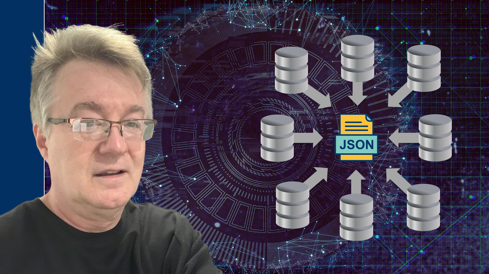

# JSON in 10 Major Relational Databases

All source code for my new [**JSON in 10 Major Relational Databases - Masterclass Hands-On**](https://www.udemy.com/course/json-in-relational-databases/) Udemy course.

## Current Project Setup

(1) From a command line, clone the [**GitHub repository for this course**](https://github.com/cristiscu/json-in-databases):  

**`git clone https://github.com/cristiscu/json-in-databases.git`**  

(2) Install [**Python**](https://www.python.org/downloads/).  

(3) Install and start [**Visual Studio Code (VSCode)**](https://code.visualstudio.com/).  

(4) From VSCode, select from *File > Open Folder* the newly created *json-in-databases* folder.

(5) From a VSCode *Terminal* window, create a **virtual environment for Python** (do this once only):  

**`python.exe -m venv venv`**  

(6) Activate the new environment (and make sure you always reactivate it whenever you run applications from the command line):  

**`venv/scripts/activate`**  

(7) In this environment, install all **Python dependencies** for our project (this may take a while):  

**`pip install -r requirements.txt`**  

(8) For each individual lecture, switch to the related **sections/** subfolder from this project. Install and connect to a specific database, following the instructions from the course lectures or the source files.  
